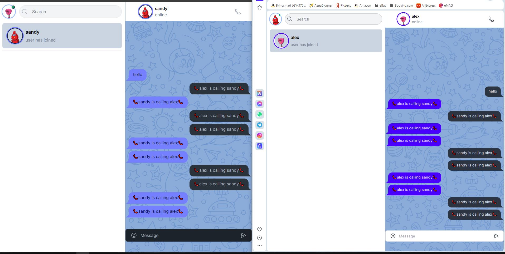

## Chat Messaging Application with React

#### This is a feature-rich React application for a real-time chat messaging system. It allows users to register (functionality not included in this code snippet), login, chat with other users, send emojis, and even participate in video conferences (commented out functionality).

### Features

- User Login and Management:
- Users can login using cookies to store their name and email securely.
- Upon initial render, the application checks for a user cookie.
- If the cookie exists, it redirects the user to the chat interface for a seamless experience.
- If not, it displays a user-friendly login form.
  T- he login form captures username and email for validation (validation logic not implemented in this code).
- Upon successful login (assuming successful validation on the server-side), the user information is stored in the cookie for future sessions.

### Real-time Chat Interface:

- The chat interface is designed for intuitive communication:
- A sidebar displays a search bar for finding specific users and a list of available users for easy selection.
- The chat window showcases the conversation history between the current user and the selected user.
- Users can send new messages through a convenient message input field.
- An emoji picker library (not included in this code) enhances communication with expressive emojis.
- The application leverages socket.io, a powerful real-time communication library, to establish a persistent connection between the client and server.
- New messages are transmitted through the socket connection to the server, ensuring real-time updates for all participants.
- Whenever a new user joins the chat or a new message arrives, the application updates the chat interface dynamically, keeping everyone in sync.

### Additional Features:

- The code includes commented-out sections for video conferencing functionalities using LiveKit, a third-party library. This can be a great future implementation to enhance user interaction.
- User avatars are dynamically generated using a service like robohash.org, providing a personalized touch to the chat experience.

### Getting Started

1. Clone this repository: Use Git to clone this repository to your local machine.
2. Install Dependencies: Open a terminal in the project directory and run npm install to install all the required libraries and dependencies.
3. Start the Development Server: Run npm start in the terminal to launch the development server. This will start the application in development mode, allowing you to make changes to the code and see the results reflected immediately.

##### Note: This README assumes a basic understanding of React and Node.js. The provided code focuses on the client-side functionalities. Server-side implementation for user registration, login validation, message storage, and real-time communication logic would be required for a fully functional application.

### Technologies Used

- React: A popular JavaScript library for building user interfaces.
- socket.io: A real-time communication library that enables bi-directional communication between the client and server.
- Third-party libraries (not included in this code):
- Emoji picker library for adding expressive emojis to chats.
- LiveKit for enabling video conferencing functionalities (commented out).

